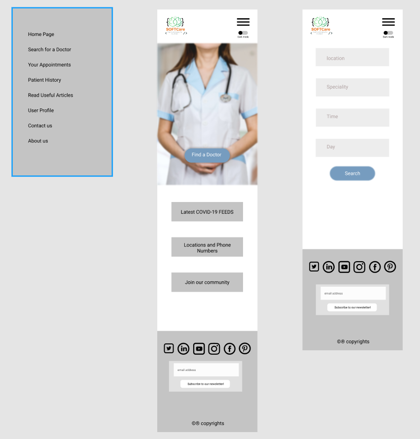
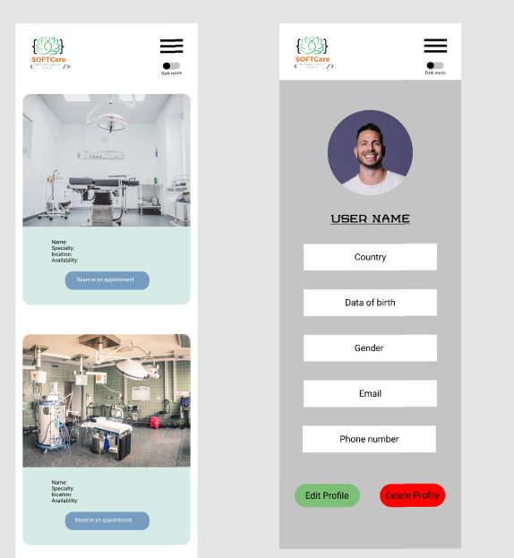

# Medicpool

[App website on Heroku](https://medicpool.herokuapp.com/)

## Project contributers:

1. Omar Ahmad Ramadan
2. Tala Hajeer
3. Faisal Abuzaid
4. Sajeda Araidah

Our project is a website where users can search for doctors according to the area they want and reserve appointments if their desired doctor is free at a given time. Users can have their medical history data saved on our database and they can access it anytime and share it with their phycision. Users can sign up and provide some prsonal data. We provide links to useful medical and health related articles.

## User Stories

1. As a user I want to find a doctor in an easy and straightforwatd UI
2. As a user I want to navigate easily thoughout the website
3. As a user I want book appoirntments to doctors and see my reservation history
4. As a user I want to sign up to the website so that my data will be stored and keept from being lost
5. As a user I want the ability yo update my user profile
6. As a user I want to know the latest Corona virus updates
7. As a user I want to read some useful health and medical articles
8. As a user I want to be able to switch the user interface to dark mode
9. As a user I want to get a discount when I go to the same clinic more than a given number of times
10. As a user I want the ability to contact with the website owner to give any feedback or comments through socail media or email
11. As a user I want to subscribe to a newsletter so that I can know latest update on the website

## Wireframes

* Mobile design




## Technologies used

* HTML
* CSS
* JavaScript
* Node
* VSCode
* Markdown
* JSON
* SQL
* EJS
* GIT
* GitHub
* BASH Shell
* Heroku
* Google Chrome
* ESLint

### Libraries and packages

* "chart.js": "^3.0.2",
* "cors": "^2.8.5",
* "dotenv": "^8.2.0",
* "ejs": "^3.1.6",
* "express": "^4.17.1",
* "jquery": "^3.6.0",
* "method-override": "^3.0.0",
* "mustache": "^4.2.0",
* "nodemon": "^2.0.7",
* "pg": "^8.5.1",
* "superagent": "^6.1.0",
* "unirest": "^0.6.0"

### APIs used

1. [CORONA Virus news API](https://github.com/M-Media-Group/Covid-19-API)
2. [Google Places API](https://www.google.com/url?q=https%3A%2F%2Fdevelopers.google.com%2Fplaces%2Fweb-service%2Fsearch%3Fhl%3Den_US)
3. [Places details API](https://www.google.com/url?q=https%3A%2F%2Fdevelopers.google.com%2Fplaces%2Fweb-service%2Fdetails%3Fhl%3Den_US)

## How to use the application

### For users

Users need to have web browser on their devices. Google Chrome latest version is highly recommended.
Users can go to this URL to start using the app: [Application website](https://medicpool.herokuapp.com/)

### For developers

They can clone the repo from the GitHub page. Use the NPM tool with Node to download packages
Run this command on the terminal:

```npm

NPM INSTALL

```

Then navigate to the cloned directory and import the file to your IDE or tect editor. VSCode is highly recommended.

* Clearly defined API endpoints with sample responses

* Clearly defined database schemas
